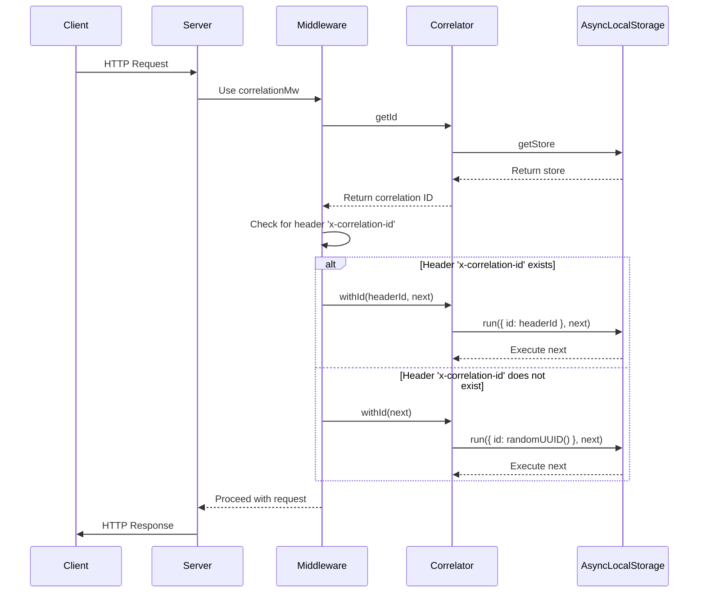

# Correlation ID Middleware

A powerful middleware for Express.js applications to handle correlation IDs across your entire application stack. This library ensures that each request has a unique correlation ID, which can be used for tracking requests through distributed systems, logging, and debugging.

## Installation

1. Install the package:
   ```sh
   npm install correlation-id-mw
   ```

## Basic Usage

### Adding the middleware to Express

```javascript
const express = require('express');
const { correlationMw } = require('correlation-id-mw');

const app = express();

// Use default header name 'x-correlation-id'
app.use(correlationMw());

// OR use a custom header name
app.use(correlationMw({ header: 'id-hly' }));

app.get('*', (req, res) => {
    // Access correlation ID directly from the request
    console.log(`Correlation ID: ${req.correlationId()}`);
    
    // You can also set a correlation ID manually if needed
    // req.setCorrelationId('custom-correlation-id');
    
    res.send('Hello World!');
});

app.listen(3000, () => {
    console.log('Server started on http://localhost:3000');
});
```

### How it works

1. When a request comes in, the middleware checks for a correlation ID in the specified header.
2. If a valid correlation ID is present, it's used for the request context.
3. If no correlation ID is found or it's invalid, a new UUID is generated.
4. The correlation ID is added to the response headers.
5. The ID is made available throughout the request lifecycle via `req.correlationId()`.
6. Log entries are automatically sent to Graylog (if configured) with the correlation ID.

## Propagating Correlation IDs to Outbound Requests

To properly track requests across services, you need to propagate the correlation ID to any outbound requests.

### With Axios

```javascript
const axios = require('axios');
const { correlator } = require('correlation-id-mw/lib/correlationIdHelper');

function createAxiosInstance(headerName = 'x-correlation-id') {
    const instance = axios.create();
    
    // Add request interceptor to include correlation ID
    instance.interceptors.request.use((config) => {
        const correlationId = correlator.getId();
        if (correlationId) {
            config.headers[headerName] = correlationId;
        }
        return config;
    });
    
    return instance;
}

// Usage in your application
const axiosWithCorrelation = createAxiosInstance();

// Make requests that will automatically include the correlation ID
app.get('/api/users', async (req, res) => {
    try {
        const response = await axiosWithCorrelation.get('https://api.example.com/users');
        res.json(response.data);
    } catch (error) {
        res.status(500).send('Error fetching users');
    }
});
```

### With Fetch API

```javascript
const { correlator } = require('correlation-id-mw/lib/correlationIdHelper');

async function fetchWithCorrelation(url, options = {}) {
    const correlationId = correlator.getId();
    
    // Initialize headers if they don't exist
    if (!options.headers) {
        options.headers = {};
    }
    
    // Add correlation ID to headers if it exists
    if (correlationId) {
        options.headers['x-correlation-id'] = correlationId;
    }
    
    return fetch(url, options);
}

// Usage in your application
app.get('/api/products', async (req, res) => {
    try {
        const response = await fetchWithCorrelation('https://api.example.com/products');
        const data = await response.json();
        res.json(data);
    } catch (error) {
        res.status(500).send('Error fetching products');
    }
});
```

### With MQTT

```javascript
const mqtt = require('mqtt');
const { correlator } = require('correlation-id-mw/lib/correlationIdHelper');

function createMqttClient(brokerUrl, options = {}) {
    const client = mqtt.connect(brokerUrl, options);
    
    // Enhance publish method to include correlation ID
    const originalPublish = client.publish;
    client.publish = function(topic, message, options = {}, callback) {
        let modifiedMessage = message;
        
        try {
            // If message is a string, try to parse it as JSON
            if (typeof message === 'string') {
                try {
                    const parsedMessage = JSON.parse(message);
                    parsedMessage.correlationId = correlator.getId();
                    modifiedMessage = JSON.stringify(parsedMessage);
                } catch (e) {
                    // Not valid JSON, leave as is
                }
            } 
            // If message is a Buffer, convert to string, modify, and back to Buffer
            else if (Buffer.isBuffer(message)) {
                try {
                    const parsedMessage = JSON.parse(message.toString());
                    parsedMessage.correlationId = correlator.getId();
                    modifiedMessage = Buffer.from(JSON.stringify(parsedMessage));
                } catch (e) {
                    // Not valid JSON, leave as is
                }
            }
        } catch (err) {
            console.error('Error adding correlation ID to MQTT message:', err);
        }
        
        return originalPublish.call(this, topic, modifiedMessage, options, callback);
    };
    
    return client;
}

// Usage in your application
const mqttClient = createMqttClient('mqtt://broker.example.com');

app.post('/mqtt/publish', (req, res) => {
    mqttClient.publish('topic/example', JSON.stringify(req.body));
    res.send('Message published');
});
```

### With HTTP/HTTPS module

```javascript
const http = require('http');
const https = require('https');
const { correlator } = require('correlation-id-mw/lib/correlationIdHelper');

function requestWithCorrelation(options, callback) {
    const correlationId = correlator.getId();
    
    if (!options.headers) {
        options.headers = {};
    }
    
    if (correlationId) {
        options.headers['x-correlation-id'] = correlationId;
    }
    
    const requester = options.protocol === 'https:' ? https : http;
    return requester.request(options, callback);
}

// Usage
app.get('/api/data', (req, res) => {
    const options = {
        hostname: 'api.example.com',
        path: '/data',
        method: 'GET'
    };
    
    const request = requestWithCorrelation(options, (response) => {
        let data = '';
        response.on('data', (chunk) => {
            data += chunk;
        });
        
        response.on('end', () => {
            res.send(JSON.parse(data));
        });
    });
    
    request.on('error', (error) => {
        res.status(500).send(`Error: ${error.message}`);
    });
    
    request.end();
});
```

## Advanced Usage

### Accessing the correlator directly

You can access the correlator for advanced use cases:

```javascript
const { correlator } = require('correlation-id-mw/lib/correlationIdHelper');

function complexOperation() {
    // Execute code in a new correlation context
    return correlator.withId(() => {
        const id = correlator.getId();
        console.log(`Operation running with correlation ID: ${id}`);
        
        // Do work here
        return someAsyncOperation()
            .then(result => {
                console.log(`Operation completed with correlation ID: ${correlator.getId()}`);
                return result;
            });
    });
}
```

### Creating correlation-aware wrappers for third-party libraries

You can create wrappers for any third-party library to make it correlation-aware:

```javascript
function correlationAwareWrapper(library) {
    return new Proxy(library, {
        get(target, prop) {
            const value = target[prop];
            
            // If it's a function, wrap it with correlation context
            if (typeof value === 'function') {
                return function(...args) {
                    const correlationId = correlator.getId();
                    
                    // If we have a correlation ID, make sure it's preserved
                    if (correlationId) {
                        return correlator.withId(correlationId, () => {
                            return value.apply(target, args);
                        });
                    }
                    
                    // Otherwise just call the original function
                    return value.apply(target, args);
                };
            }
            
            return value;
        }
    });
}

// Usage
const redis = correlationAwareWrapper(require('redis'));
const client = redis.createClient();
```

## Logging Integration

### Automatic Graylog Integration

The middleware automatically sends logs to Graylog with the correlation ID attached.

### Using with Winston

```javascript
const winston = require('winston');
const { correlator } = require('correlation-id-mw/lib/correlationIdHelper');

// Create a custom format that adds the correlation ID
const correlationFormat = winston.format((info) => {
    const correlationId = correlator.getId();
    if (correlationId) {
        info.correlationId = correlationId;
    }
    return info;
});

// Create logger
const logger = winston.createLogger({
    format: winston.format.combine(
        correlationFormat(),
        winston.format.json()
    ),
    transports: [
        new winston.transports.Console()
    ]
});

// Usage
app.get('/api/log', (req, res) => {
    logger.info('Processing request', { path: req.path });
    res.send('Logged!');
});
```

## Example Application

A complete example server is included in the `example` directory:

```sh
# Run the example server
npm run dev
```

The server will start on `http://localhost:3001`. All incoming requests will have a correlation ID attached to the `id-hly` header.

## Running Tests

```sh
npm test
```

## How it Works - Technical Deep Dive

The correlation middleware uses Node.js's AsyncLocalStorage to maintain correlation context across asynchronous operations:



1. The middleware intercepts each HTTP request.
2. It checks for a correlation ID in the request header.
3. If found and valid, it uses that ID; otherwise, it generates a new UUID.
4. It creates a correlation context using AsyncLocalStorage.
5. All code that runs within that context can access the correlation ID.
6. The middleware attaches the ID to the response headers.

## Contributing

Contributions are welcome! Please open an issue or submit a pull request for any changes.

---

*Made with 🖤 by kur0.*